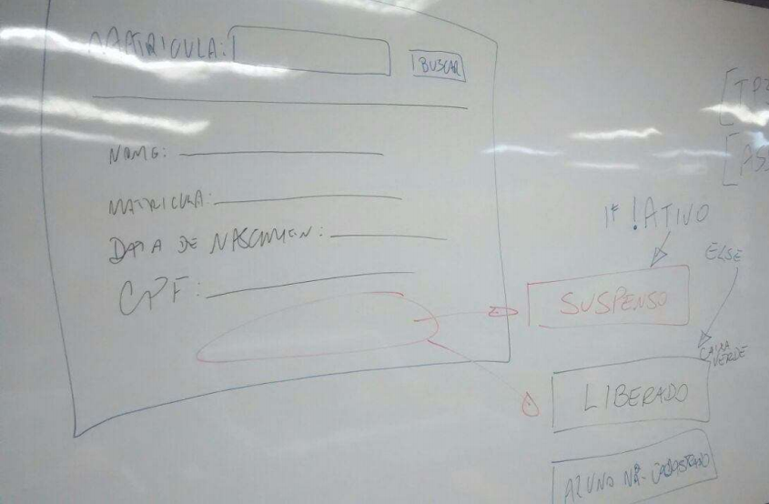
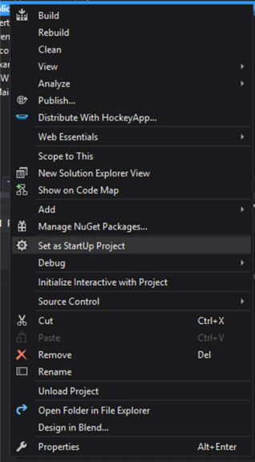
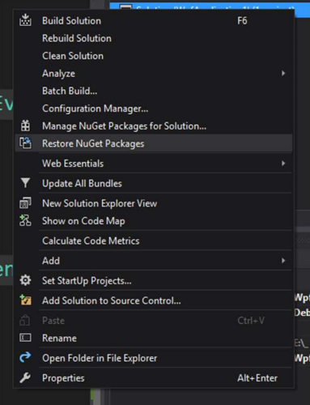

# ADS1T1M.TP3.MunirXavierWanis

## TP3 - Alternativo

### Desenvolvimento de uma aplicação de carga de dados

1. Criar uma solução em branco. Nome da solução: ADS1T1M.TP3.SEU_NOME.Solution

2. Criar uma pasta de solução (solution folder) para as camadas de Apresentação (1Presentation) e Domínio (4-Domain)

Adicionar um projeto Console Application em Apresentação:
ADS1T1M.TP3.SEU_NOME.Presentation.ConsoleApp

Adicionar um projeto Class Library em Domain: ADS1T1M.TP3.SEU_NOME.Domain
(apagar Class1 e referências [menos System e Analyzers])

Em Domain, criar a pasta Entities

Em Domain, criar uma classe para Aluno dentro da pasta Entities. Aluno deve ter um identificador, nome, matricula, data de nascimento, cpf, ativo (bool).

Adicionar uma nova Solution Folder: 5-Infra

Dentro de 5-Infra, crie uma nova Solution Folter 5.1-Data

Dentro de 5.1-Data, adicionar um projeto Class Library

ADS1T1M.TP3.SEU_NOME.Infra.Data (apagar Class1 e referências [menos System e Analyzers])

Adiconar o Entity Framework via Nuget em Infra.Data

Criar em Infra.Data uma pasta Contexts e dentro desta, uma classe EntityContextDb, que servirá de classe de contexto. A classe deve Herdar de DbContext.

Adicione em Infra.Data uma referência para Domain.

Dentro desta classe (EntityContextDb), adicione uma propriedade do tipo `DbSet<Aluno>`

Ache no “window explorer” o diretório da solução. Crie uma pasta “XML-Original”. Coloque os dois arquivos XML dentro dele.

1º arquivo: você deverá criar um arquivo XML (“exporte-alunos-01.xml”) com a estrutura abaixo, para 8 alunos (sugiro o uso dos nomes dos colegas de sala).

```xml
<?xml version="1.0" encoding="utf-8"?>
<alunos>
  <aluno>
    <matricula>fn944098u</matricula>
    <nome>PauloMau</nome>
    <datadenascimento>24/10/1967</datadenascimento>
    <cpf>84189380210</cpf>
    <ativo>1</ativo>
  </aluno>
  <aluno>
    <matricula>9j35tnfgn</matricula>
    <nome>PauloMau</nome>
    <datadenascimento>24/10/1967</datadenascimento>
    <cpf>84189380210</cpf>
    <ativo>0</ativo>
  </aluno>
</alunos>
```

2º arquivo: você deverá criar um segundo (“exporte-alunos-02.xml”) arquivo XML, com os 8 alunos anteriores. Escolha uns 4 alunos e modifique a propriedade ativo... Se for 0, mude para 1. Se for 1, mude para 0. E acrescente mais 3 alunos neste arquivo.

Você deve criar uma pasta Data, dentro do diretório da solução. Copie o primeiro arquivo para dentro da pasta e renomei para “exporte-alunos.xml”.

Em ConsoleApp, você deverá adicionar referências para Infra.Data e Domain. Deverão adicionar via Nuget, o Entity Framework.

LÓGICA: Você precisa no ConsoleApp:

Ler o arquivo XML (“exporte-alunos.xml”) que está dentro da pasta Data usando a classe XmlDocument. Veja o material que deixei no Moodle.

Ler o registro do aluno no arquivo e verificar se o aluno existe na base. Caso negativo: inclua o aluno.

Caso o aluno exista na base, verifique se houve mudança na propriedade "ativo". Se houve, altere o dado na base. Senão, não faça nada.

Você deverá registrar em um arquivo texto ("exporte-alunos-log-de-carga-201612071749.txt"), que deverá ficar dentro da pasta Data, cada operação feita na base, ou não. A numeração no arquivo é a data e hora do momento da criação do arquivo. Esta data e hora deverá ser guardada para uso posterior.

Caso o aluno não exista na base, a linha no log deve ser:

matricula>9j35tnfgn; nome>PauloMau; ativo>0; Adicionado;

Caso o aluno exista na base e não haja nada para fazer, a linha no log deve ser:

matricula>9j35tnfgn; nome>PauloMau; ativo>0; OK;

Caso o aluno exista na base e haja algo para fazer, a linha no log deve ser:

matricula>9j35tnfgn; nome>PauloMau; ativo>0; Alterado: ativo>1;

Uma vez que termine a leitura do arquivo XML, o mesmo deverá ser renomeado para:

“exporte-alunos-20161207-1749.xml”, veja que a numeração é a data e hora que falei para guardar.

Pegue o segundo arquivo “exporte-alunos-02.xml”, copie para dentro da pasta Data e renomei para “exporte-alunos.xml”

Execute o programa novamente.

No final, deverá haver dois arquivos XML dentro da pasta Data, renomeados com as datas da execução. E deverá haver dois outros arquivos texto de log, cada um correspondente a um arquivo XML. 

Requerido:

Programação Orientada a Objetos. Em Program e Main, só deverá ter as chamadas necessárias, a exemplo das demonstrações do System.Io que deixei no Moodle.

Indentação de código.

Realizar cada uma das tarefas solicitadas. 

## Assessment - Alternativo

Desenvolvimento de uma aplicação desktop com WPF para consulta de dados 

1. Abra a Solution do seu TP3 Alternativo
2. Na Solution Folder “1-Presentation”, adicione um projeto WPF Application

> ADS1T1M.TP3.SEU_NOME.Presentation.WPFApp

Você deverá adicionar referências para Infra.Data e Domain. Deverá adicionar via Nuget, o Entity Framework.

Esta é ideia da interface:



### Elementos mínimos:

Parte superior da tela: um Label para “Matrícula:”, um TextBox para “matricula” e um Button “btnBuscarMatricula” “Buscar Matrícula”

Inclua um evento on-click para o botão.

Parte intermediária da tela: um Label e um TextBlock para cada informação: Nome, Matrícula, Data de Nascimento e CPF.

Parte inferior da tela: um TextBlock, com altura e largura definidos e com texto centralizado.

Este elemento não poderá estar visível na tela. Só deverá ser apresentado, quando necessário.

Procure na internet como manter escondido um elemento no WPF. Adianto que é muito simples e que é uma propriedade do mesmo.

Execução do programa: um usuário poderá digitar o número de uma matrícula e clicar no botão de busca. Uma vez que se encontre ou não a matrícula procurada, dados deverão ser apresentados na tela.

### OBSERVAÇÃO

Para evitar problemas na execução de ambos os projetos dentro da Solution, você deve definir a string de conexão no arquivo app.config de ambos os projetos.

A string de conexão deve ser colocada imediatamente após o fechamento da tag

```xml
</appSettings>
```

Não esqueça de trocar “SeuNome” na string abaixo

```xml
</appSettings>
<connectionStrings>
 <add name="OperasDB" connectionString="DataSource=(localdb)\MSSQLLocalDB;AttachDbFilename=|DataDirectory|\ASS_16t4_SeuNome.mdf;Integrated Security=True" providerName="System.Data.SqlClient" />
</connectionStrings>
```
Não esqueça, para executar um projeto, você deve defini-lo como projeto de start, faça isso clicando om o botão direito sobre o projeto e depois na opção “Set as StartUp Project” 



### LÓGICA:
No método que representa o click do botão, que você incluiu anteriormente, você deve:

Recuperar a matrícula digitada e realizar uma consulta na base de dados, que foi criada anteriormente no TP3 Alternativo.

Caso não encontre a matrícula digitada, deverá apresenta no TextBlock, a frase “Aluno não cadastrado”. O TextBlock deverá ter fundo azul e letra branca em negrito (bold).

Caso encontre a matrícula e o aluno esteja Ativo = true. Deverá apresenta no TextBlock, a frase “Aluno liberado”. O TextBlock deverá ter fundo verde e letra branca em negrito (bold). Os dados do aluno deverão ser apresentados na tela.

Caso encontre a matrícula e o aluno esteja Ativo = false. Deverá apresenta no TextBlock, a frase “Aluno suspenso”. O TextBlock deverá ter fundo vermelho e letra branca em negrito (bold). Os dados do aluno deverão ser apresentados na tela.

Ao realizar uma nova consulta, o elemento TextBlock deverá ficar invisível novamente.

#### Códigos de apoio

```xml
<TextBox x:Name="matricula" TextChanged="matricula_TextChanged" ......
<Button x:Name="btnBuscarMatricula" Content="Buscar Matrícula"
<TextBlock x:Name="tbkRetorno" Height="35" Width="300" TextAlignment="Center" FontSize="25" Background="Blue" Foreground="White" FontWeight="Bold" Visibility="Hidden" ......
```

```c#
private void matricula_TextChanged(object sender, TextChangedEventArgs e)
{
    tbkRetorno.Visibility = Visibility.Hidden;
} 
```

### Regras e orientações:

1. Você deverá refatorar (arrumar) o código original do TP3, para seguir os princípio da orientação a objetos e engenharia de software.
  1. Princípio da Responsabilidade Única
  2. Princípio do Aberto-Fechado
  3. Princípio da Substituição de Liskov (se houver herança)
  4. Princípio da Segregação de Interface

2. Coloque a pasta da solução original do TP3 Alternativo dentro de uma pasta chamada “Assessment Seu_NOME”, e compacte esta pasta para envio. **MÉTODO DE COMPACTAÇÃO: ZIPADO**.
```diff
- Não seguir esta simples orientação, provocará a perda de 50% do valor da nota.
```

3. Antes de compactar, exclua os arquivos internos da pasta package, bim e
obj. Isso vai diminuir o tamanho do zip,
```diff
- mas antes desta ação, abra a Solution e clique com o botão direito nela. Clique na opção “Restore Nuget Packages. Salve a Solution. Feche a Solution.
```


4. Rubrica:
  1. O aluno deverá apresentar a Solution conforme o especificado no “TP3 Alternativo” e “Assessemt Alternativo”.
  2. Aplicação funcionando.
  3. Código indentado.
  4. Não cometer plágio. Fazer em dupla, trio e etc. é uma coisa. Ter partes dos códigos e/ou telas idênticos é plágio. ZERO PARA TODOS OS ENVOLVIDOS. Será solicitado à Coordenação a aplicação das punições acadêmicas definidas nos regulamentos do INSTITUTO INFNET. 
  5. O aluno seguiu o princípio mais importante: Princípio da Responsabilidade Única, criando as classes e os métodos adequados à execução da lógica necessária ao funcionamento correto do software, conforme especificado.
  6. O aluno utilizou Interfaces para definir os métodos públicos das classes que precisou criar.
  7. A tela estava de acordo com os elementos mínimos necessários
  8. Apresentou corretamente as mensagens na tela, conforme a situação do aluno ou a inexistência de cadastro.
  9. Reorganizou o projeto ConsoleApp conforme os princípios OO.
  10. Fez uso correto das camadas de Domain e Infra.Data.
  11. O aluno fez uso correto dos elementos do WPF, conforme o tipo de recurso apresentado na tela.
  12. A lógica utilizada no projeto ConsoleApp está correta.
  13. A lógica utilizada no projeto WPFApp está correta.